```{r setup, include=FALSE}
knitr::opts_chunk$set(echo = TRUE)
```

### 0.5 Locate your outcome

### 1. Upload the outcome

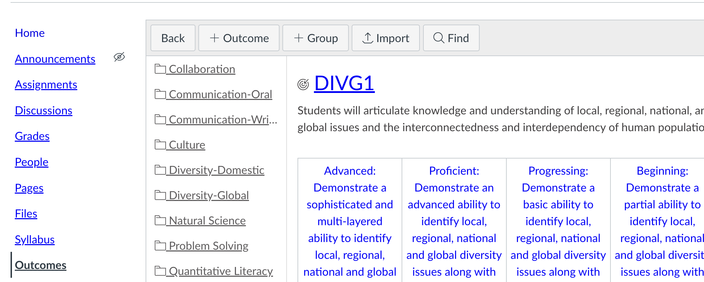

Click 'import' on the top menu.

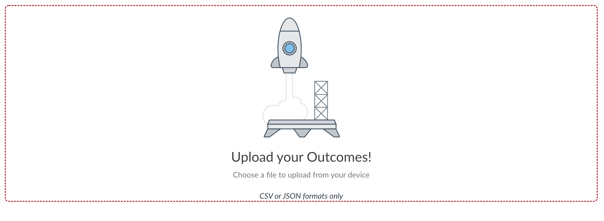
Click anywhere to open the file chooser.

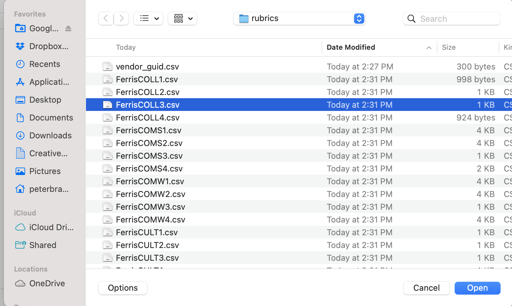
Choose the CSV file corresponding to the outcome we're assessing this year. Once the file is uploaded, you'll see a 'processing' page for a moment.


When complete, it should show:

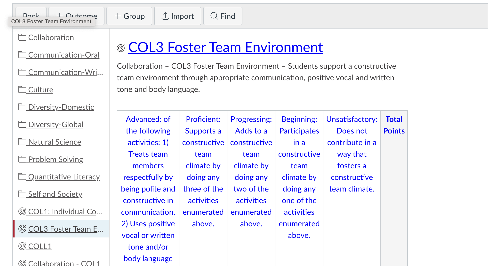

### 2. Extract the rubric

Navigate to the 'Rubrics' section using the left-hand menu.

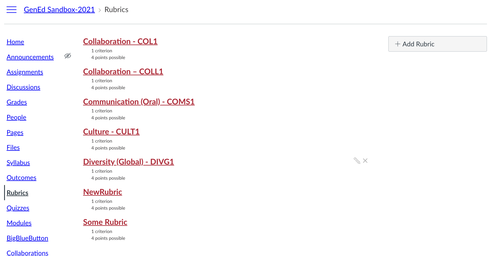

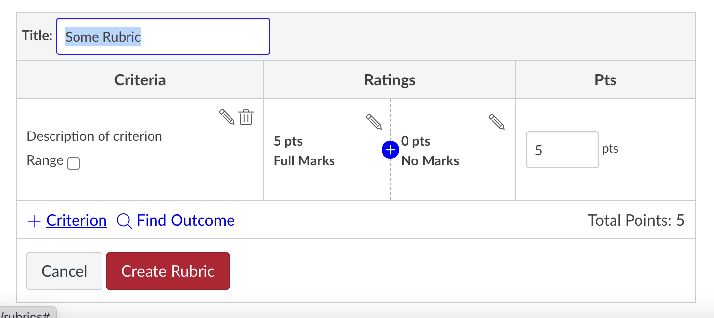


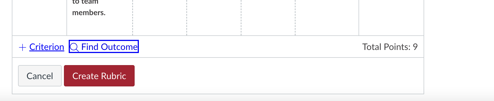
Click on 'Find Outcome'

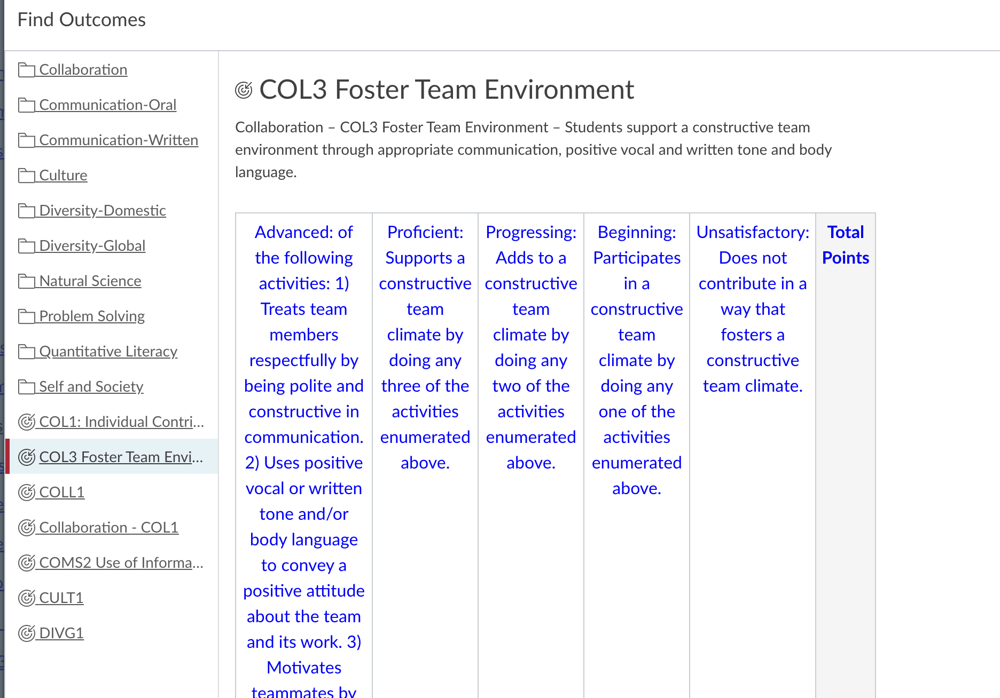

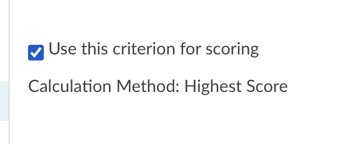

See Enabling Learning Mastery Gradebook.

### 3. Create the Quiz

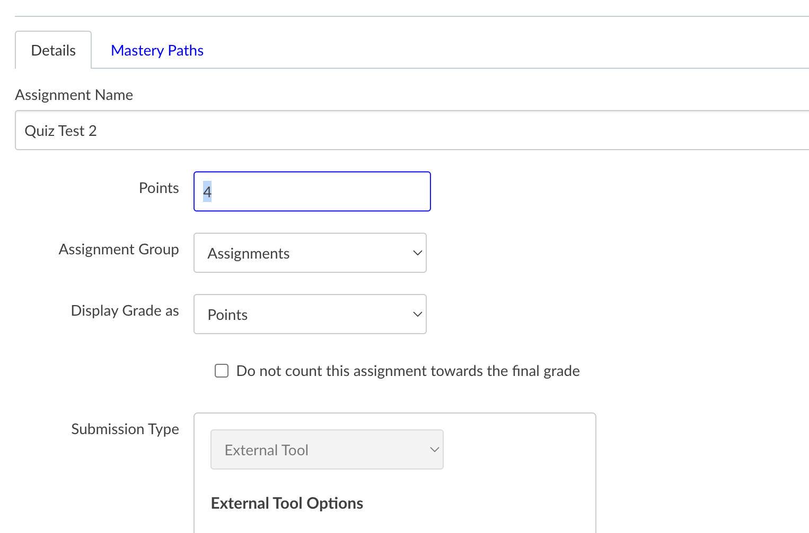

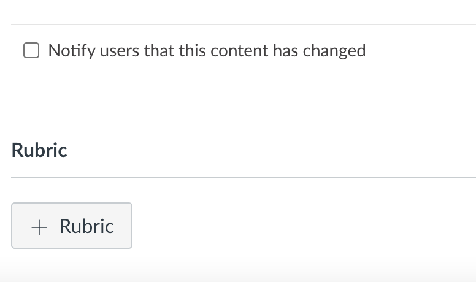

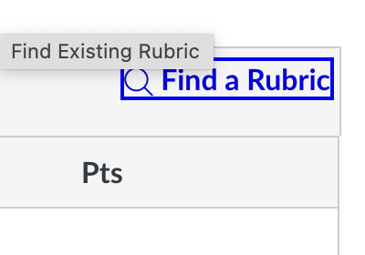

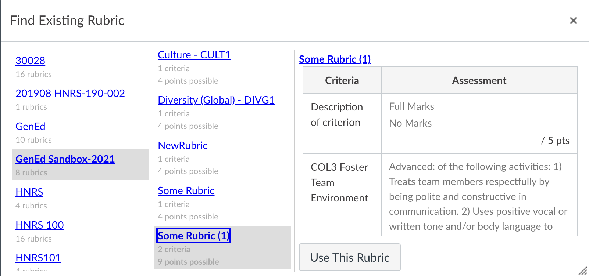


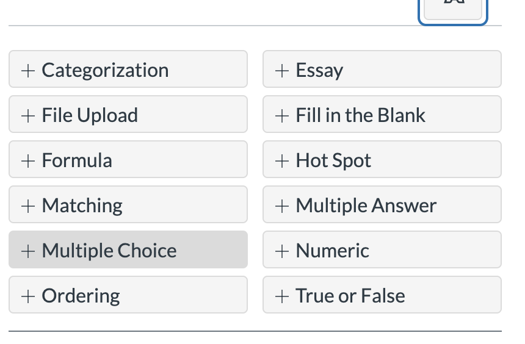

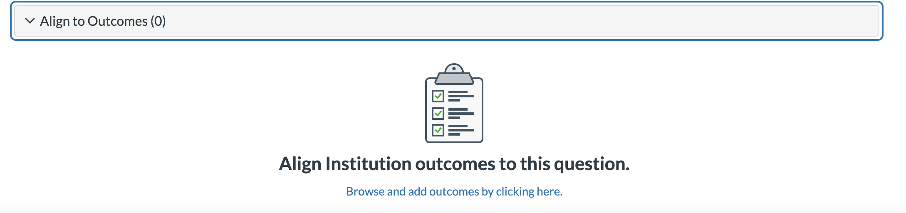


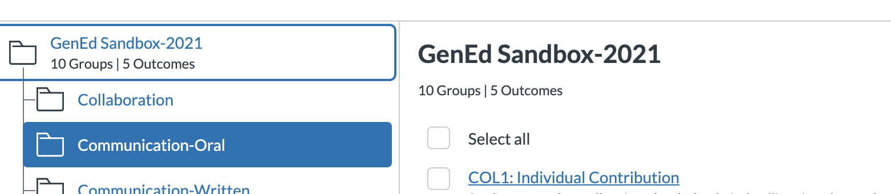

